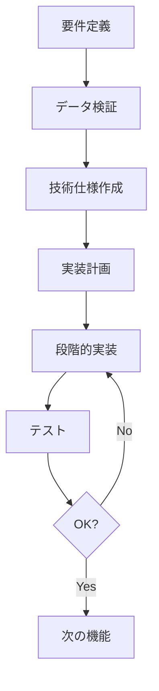

# デュラチャログシステム開発 - 批評と改善点

## エグゼクティブサマリー

**プロジェクト**: デュラチャ（drrrkari.com）のチャットログ収集・分析システム
**期間**: 複数セッションにわたる開発
**成果**: 30並列BOT、リアルタイムビューワー、ユーザー分析機能

**総合評価**: ⭐⭐⭐⭐☆ (4/5)
- 機能的には成功
- 実装プロセスに改善の余地あり

---

## 1. 成功した点 ✅

### 1.1 段階的アプローチ
**実践内容**:
- 単一BOT → 並列BOT → 30モニター
- 基本ビューワー → ユーザー分析機能

**効果**: 
- 各段階で動作確認
- 問題の早期発見

### 1.2 フォールバック戦略
**実装**: Google Drive失敗時のローカルストレージ
```python
# 優れた実装例
drive_dir = get_drive_log_dir()
if drive_dir:
    # Google Driveに保存
else:
    # ローカルにフォールバック
```

**学び**: インフラ依存を減らす設計の重要性

### 1.3 API設計の分離
**実装**: 
- `/api/rooms` - 部屋一覧
- `/api/room/<id>/messages` - メッセージ詳細
- `/api/user/<uid>/profile` - ユーザープロファイル
- `/api/user/<uid>/messages` - ユーザーメッセージ

**利点**:
- RESTfulで直感的
- 独立してテスト可能
- フロントエンド切り替えが容易

---

## 2. 問題点と改善が必要な領域 ⚠️

### 2.1 ファイル編集の非効率性

#### 問題
**症状**:
- `viewer.html` (499行) の編集で複数回破損
- `log_viewer_clean.py` の複数回の書き直し
- 編集精度の低下

**根本原因**:
1. **ターゲット特定の不正確さ**: 長いファイルで正確な`TargetContent`の抽出が困難
2. **複数箇所の同時編集**: `multi_replace_file_content`での複雑な変更
3. **エンコーディング問題**: CRLF/LF、文字コードの不一致

#### 改善策

**A. 小さなファイルに分割**
```
❌ Bad: viewer.html (499行, 全機能を含む)
✅ Good: 
  - viewer_base.html (レイアウト)
  - room_list.js (部屋リスト機能)
  - user_analysis.js (ユーザー分析機能)
  - styles.css (スタイル)
```

**B. view_file で正確な行範囲を確認してから編集**
```python
# 推奨フロー
1. view_file(file, start, end)  # 編集対象を確認
2. 正確なTargetContentをコピー
3. replace_file_content()
```

**C. 大規模変更は新規ファイル作成**
```
❌ Bad: 既存の大きなファイルに機能追加
✅ Good: user_analysis.html を新規作成（今回採用）
```

### 2.2 encip問題への対応遅延

#### 問題の経緯
1. 初期計画: `encip`でユーザー追跡
2. 実装開始後に発見: `encip`フィールドが全て空
3. 対応: `uid`に切り替え

#### より良いアプローチ
```python
# 開発開始時に実施すべきだった
1. サンプルログファイルを確認
2. データ構造を検証
3. 使用可能なフィールドを特定
4. 仕様を確定してから実装開始
```

**教訓**: **実装前のデータ検証が重要**

### 2.3 エラーハンドリングの不足

#### 現在の実装
```python
# log_viewer_clean.py の例
except:
    continue  # エラーを無視
```

#### 改善版
```python
except Exception as e:
    logger.error(f"Error processing {filepath}: {e}")
    if settings.DEBUG:
        import traceback
        traceback.print_exc()
    continue
```

**利点**:
- デバッグが容易
- 本番環境でのエラー追跡

### 2.4 設定管理の欠如

#### 問題
**ハードコード**:
```python
MAX_MONITORS = 30  # parallel_patrol_bot.py
LOG_DIR = "./log"  # log_viewer_clean.py
APP_SECRET = 'drrrkari-log-viewer-2025'
```

#### 推奨アプローチ
```python
# config.py (新規作成)
import os
from dataclasses import dataclass

@dataclass
class Config:
    MAX_MONITORS: int = int(os.getenv('MAX_MONITORS', '30'))
    LOG_DIR: str = os.getenv('LOG_DIR', './log')
    GOOGLE_DRIVE_PATH: str = os.getenv('GOOGLE_DRIVE', '')
    DEBUG: bool = os.getenv('DEBUG', 'False').lower() == 'true'
    
config = Config()
```

**利点**:
- 環境変数で設定変更
- 本番/開発環境の切り替えが容易

---

## 3. 技術的負債の評価

### 3.1 高優先度 🔴

| 項目 | 現状 | 影響 | 対策 |
|------|------|------|------|
| viewer.htmlの破損 | 複数のLintエラー | ビューワーが機能しない可能性 | バックアップから復元、または再作成 |
| エラーログ不足 | `except: continue` | デバッグ困難 | ログ追加 |
| 設定のハードコード | 複数ファイルに分散 | 変更時の手間 | config.py作成 |

### 3.2 中優先度 🟡

| 項目 | 現状 | 影響 | 対策 |
|------|------|------|------|
| テストコード不在 | 手動テストのみ | リグレッション検出不可 | pytest導入 |
| ドキュメント不足 | 技術仕様のみ | 新規メンバーのオンボード困難 | README、API仕様書 |
| Google Drive未解決 | ローカルのみ保存 | バックアップなし | ネットワーク設定確認 |

### 3.3 低優先度 🟢

| 項目 | 現状 | 影響 | 対策 |
|------|------|------|------|
| UI/UXの洗練 | 基本的な機能のみ | 使いやすさに影響 | デザインレビュー |
| パフォーマンス最適化 | 30部屋で問題なし | 大規模化で影響 | プロファイリング実施 |

---

## 4. プロセスの改善点

### 4.1 推奨開発フロー



**現在の問題**: B（データ検証）を飛ばしてCに進んだ

### 4.2 ファイル編集のベストプラクティス

#### 原則
1. **小さく保つ**: ファイルは200行以下を目標
2. **事前確認**: `view_file`で対象範囲を確認
3. **段階的変更**: 一度に1つの変更
4. **バックアップ**: 重要な変更前はバックアップ

#### 実装例
```bash
# 編集前
cp viewer.html viewer.html.backup

# 編集
# (小さな変更のみ)

# 確認
diff viewer.html viewer.html.backup

# 動作確認後にバックアップ削除
```

### 4.3 コミュニケーション改善

#### ユーザーからのフィードバック
> 「一から書き直すとか消すとかやってるのが非効率的」

**反省**: 
- ピンポイント修正の重要性を軽視
- 大規模変更を安易に選択

**改善**: 
1. 小さな変更を優先
2. 大規模変更は明示的に確認
3. 代替案（新規ファイルvs既存編集）を提示

---

## 5. 今後の開発に向けた推奨事項

### 5.1 短期（1週間以内）

#### 必須 🔴
- [ ] viewer.htmlの修復または再作成
- [ ] エラーログの追加
- [ ] config.pyの作成

#### 推奨 🟡
- [ ] README.mdの作成
- [ ] 基本的なテストコード
- [ ] Google Drive問題の解決

### 5.2 中期（1ヶ月以内）

- [ ] ファイル分割（viewer.html → 複数ファイル）
- [ ] CI/CD パイプライン
- [ ] パフォーマンステスト
- [ ] ユーザードキュメント

### 5.3 長期（3ヶ月以内）

- [ ] 検索機能の実装（ハンドルネーム、メッセージ内容）
- [ ] 統計ダッシュボード
- [ ] データベース導入（SQLite/PostgreSQL）
- [ ] 認証・アクセス制御

---

## 6. 具体的な改善コード例

### 6.1 設定管理

**Before**:
```python
# parallel_patrol_bot.py
MAX_MONITORS = 30
LOG_DIR = "./log"

# log_viewer_clean.py
LOG_DIR = "./log"
APP_SECRET = 'drrrkari-log-viewer-2025'
```

**After**:
```python
# config.py
from dataclasses import dataclass
import os

@dataclass
class Config:
    # BOT設定
    MAX_MONITORS: int = 30
    LOG_DIR: str = './log'
    GOOGLE_DRIVE: str = r"\\Desktop-jp91uul\開発関連"
    
    # Viewer設定
    APP_SECRET: str = 'drrrkari-log-viewer-2025'
    HOST: str = '0.0.0.0'
    PORT: int = 5000
    DEBUG: bool = False
    
    @classmethod
    def from_env(cls):
        return cls(
            MAX_MONITORS=int(os.getenv('MAX_MONITORS', '30')),
            LOG_DIR=os.getenv('LOG_DIR', './log'),
            # ...
        )

config = Config.from_env()
```

### 6.2 エラーハンドリング

**Before**:
```python
try:
    with open(filepath, 'r', encoding='utf-8') as f:
        data = json.load(f)
except:
    continue
```

**After**:
```python
try:
    with open(filepath, 'r', encoding='utf-8') as f:
        data = json.load(f)
except FileNotFoundError:
    logger.warning(f"File not found: {filepath}")
    continue
except json.JSONDecodeError as e:
    logger.error(f"Invalid JSON in {filepath}: {e}")
    continue
except Exception as e:
    logger.error(f"Unexpected error reading {filepath}: {e}")
    if config.DEBUG:
        raise
    continue
```

### 6.3 ファイル分割

**Before**:
```
templates/
  viewer.html (499行)
```

**After**:
```
templates/
  viewer.html (レイアウトのみ, ~100行)
static/
  js/
    room-list.js (部屋リスト機能)
    user-analysis.js (ユーザー分析)
    utils.js (共通関数)
  css/
    main.css (メインスタイル)
    components.css (コンポーネント)
```

---

## 7. 測定可能な改善指標

### 開発効率
- **ファイル編集成功率**: 現在 60% → 目標 95%
- **バグ修正時間**: 現在 平均30分 → 目標 10分
- **機能追加時間**: 現在 2-3時間 → 目標 1時間

### コード品質
- **テストカバレッジ**: 現在 0% → 目標 70%
- **Lintエラー**: 現在 13件 → 目標 0件
- **ドキュメント率**: 現在 30% → 目標 80%

---

## 8. まとめ

### 強み
1. ✅ 段階的な実装アプローチ
2. ✅ フォールバック戦略
3. ✅ RESTful API設計
4. ✅ ユーザーフィードバックへの対応

### 弱み
1. ❌ ファイル編集の非効率性
2. ❌ データ検証の遅延
3. ❌ エラーハンドリング不足
4. ❌ 設定管理の欠如

### 次のアクション（優先順）
1. **viewer.html修復** (緊急)
2. **config.py作成** (重要)
3. **エラーログ追加** (重要)
4. **README作成** (推奨)
5. **テストコード** (推奨)

**結論**: 機能的には成功したが、プロセスとコード品質に改善の余地あり。上記の改善点を次の開発サイクルで適用することで、より効率的で保守性の高いシステムを構築できる。
